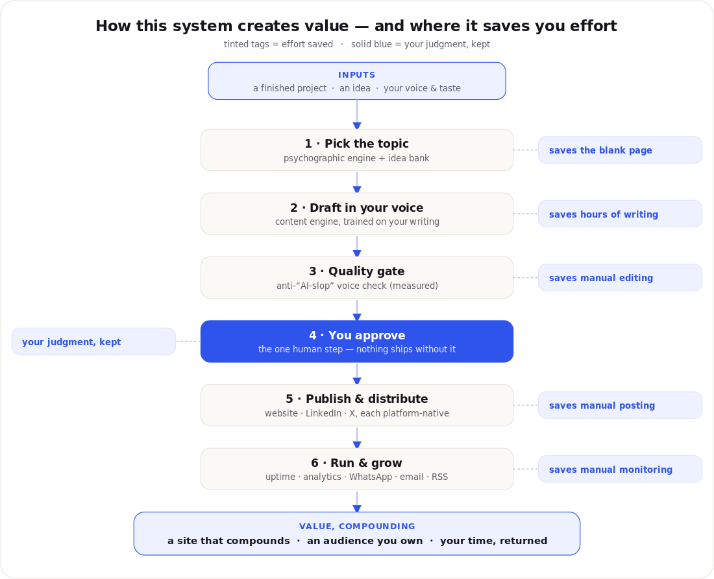

# Personal Site Engine

Turn a person's **bio, résumé, writing samples, and accounts** into a living personal website *and* the system that runs it — publishing, distributing, measuring, and growing an audience — with their judgment kept as the one required human step.

## What it builds
A fast, minimalist personal site on free hosting (GitHub Pages), wrapped in approval-gated automations:
- **Auto-published project summaries** — finish a project, approve a summary, it's live.
- **A content engine** that learns the person's voice and drafts articles, with a measurable **anti-"AI-slop" quality gate**.
- **Multi-platform distribution** — one approved piece reshaped natively for the website, LinkedIn, and X.
- **Discoverability & audience** — cookieless analytics, RSS, `Person`/`BlogPosting` schema, an email capture, and a WhatsApp channel.
- **Uptime monitoring** — daily check + diagnosed causes, plus an always-on external monitor.

Nothing publishes under the person's name without their explicit, per-item approval. No confidential specifics, no fabricated metrics, no AI-slop.

## Install
**Cowork / Claude (one click):** download `dist/personal-site-engine.plugin` (or the lighter `dist/personal-site-engine.skill`) and open it — accept the install prompt.

Then just say: *"build my personal website and publishing system."* The skill asks for your prerequisites and runs the build.

## Prerequisites you provide
Bio, résumé, 2+ writing samples, LinkedIn + X URLs, contact email, a GitHub account (free), and — created during setup — a Cloudflare account (free analytics) and a WhatsApp channel. Honest note: it's **one kickoff + a few approvals + a few one-time signups**, not a zero-touch run. The approval gates are the point.

## What's inside
A single skill (`skills/personal-site-engine/`) with the orchestrator (`SKILL.md`), reference playbooks, the genericized page templates and design system, the content/distribution/voice engine specs, and `voice_check.py` (the measurable anti-AI-slop checker). No personal data is bundled — everything is `{{PLACEHOLDERS}}`.

## License
MIT — see `LICENSE`.
